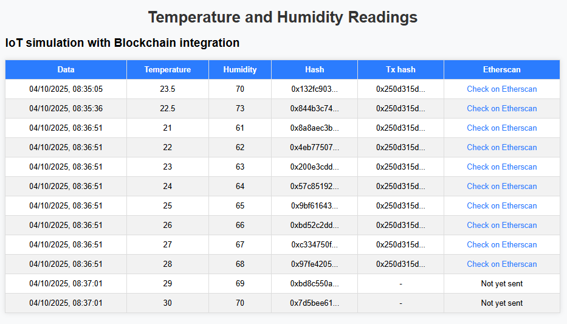

# 🌐 IoT Blockchain Storage

Sample project that reads sensor measurements (temperature and humidity), stores them in a MongoDB database, and, every 10 records, sends the hashes of the readings to the Blockchain (Solidity contract).

The simple frontend allows you to view the data, hashes, and direct links to Etherscan.

---

## 🛠️ Technologies Used

- **Backend:** Node.js + Express
- **Database:** MongoDB + Mongoose
- **Blockchain:** Solidity contract (Sepolia testnet)
- **Frontend:** Simple HTML, CSS, and JavaScript
- **Others:** CORS, REST API

---

## ⚙️ Installation and Local use

1. Clone the repository

```env
git clone https://github.com/tiagogalvao7/iot-blockchain.git
cd iot-blockchain
```

2. Create `.env` with the variables:
   ```env
   INFURA_URL=https://sepolia.infura.io/v3/YOUR_PROJECT_ID
   PRIVATE_KEY=PRIVATE_KEY
   CONTRACT_ADDRESS=CONTRACT_ADDRESS
   ```
3. Install dependency `npm install`
4. Configure variables (MongoDB URI, Ethereum private key, contract address).
5. Start server `npm start`

---

## 📦 Features

- Receive measurements (temperature + humidity) via POST.
- Save data and generate SHA256 hash for each record.
- For every 10 unsent records, send the hashes in batches to the Blockchain.
- Save the transaction's `txHash` in MongoDB.
- Endpoint to list data + hash + direct link to Etherscan.

---

## 🔗 Main Endpoints

- `POST /api/sensor-data` → Sends new measurement.
- `GET /api/sensor-data` → Lists all measurements.
- `GET /api/sensor-data/with-etherscan` → Lists measurements + Etherscan link.

---

## 📸 Table Example (MongoDB)

Here's a quick look at the table in action:


